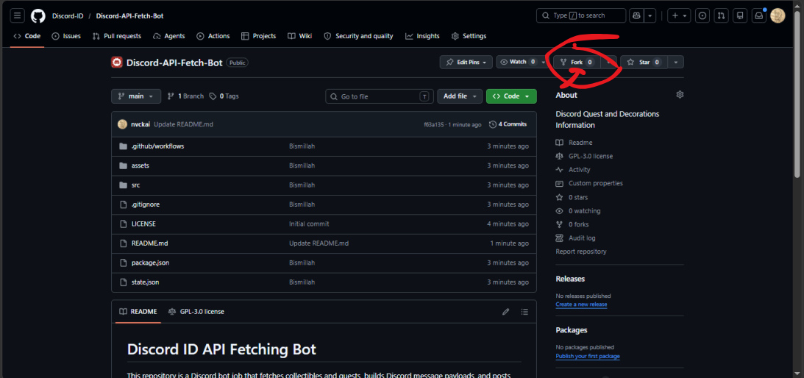
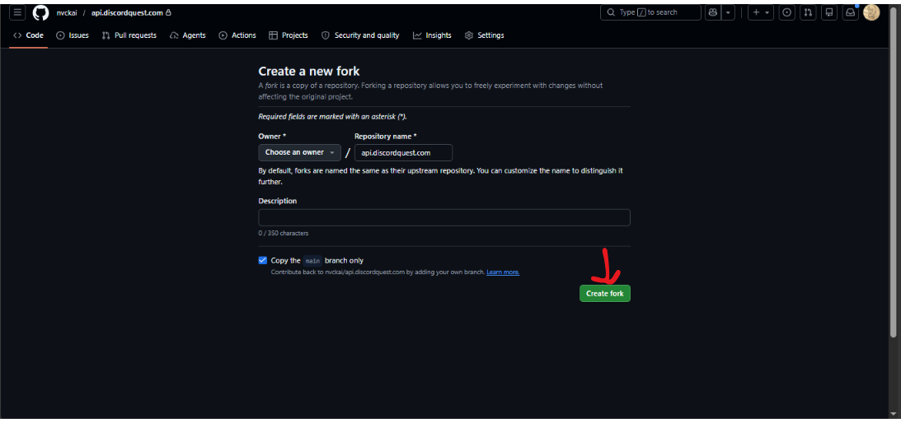
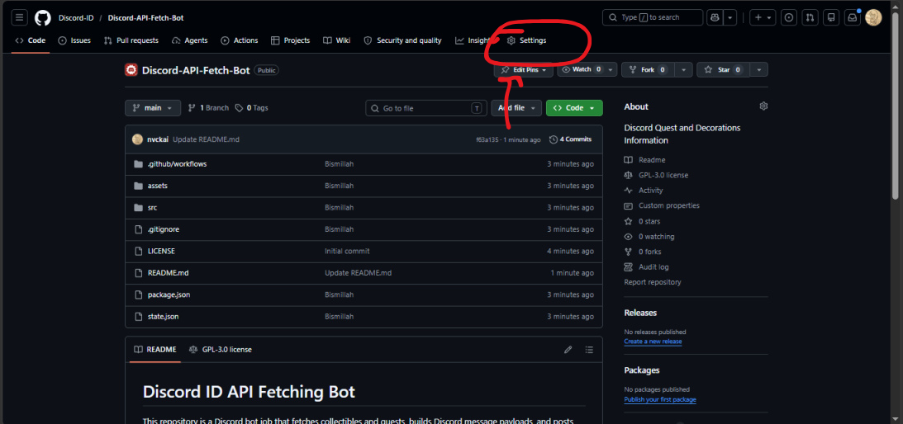
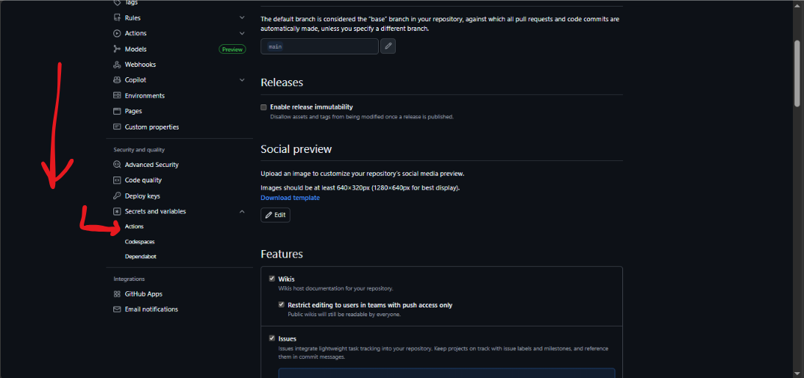
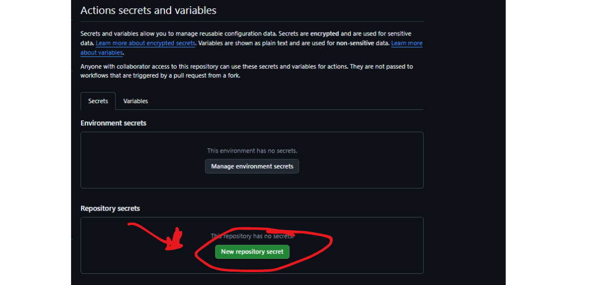
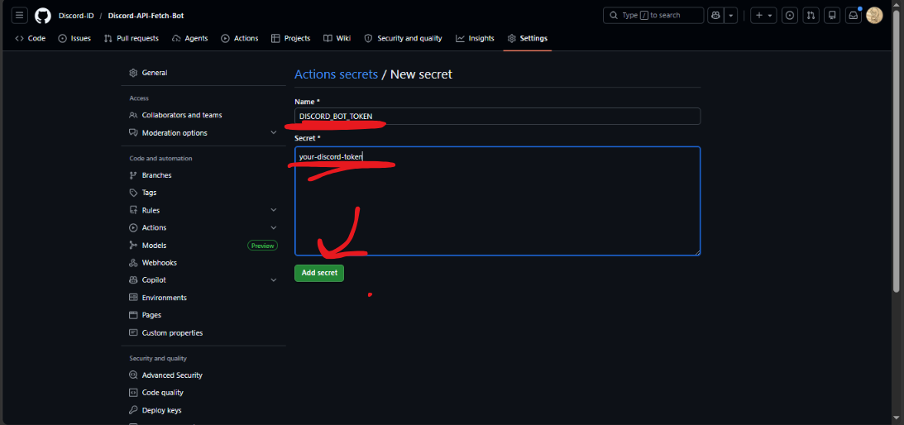
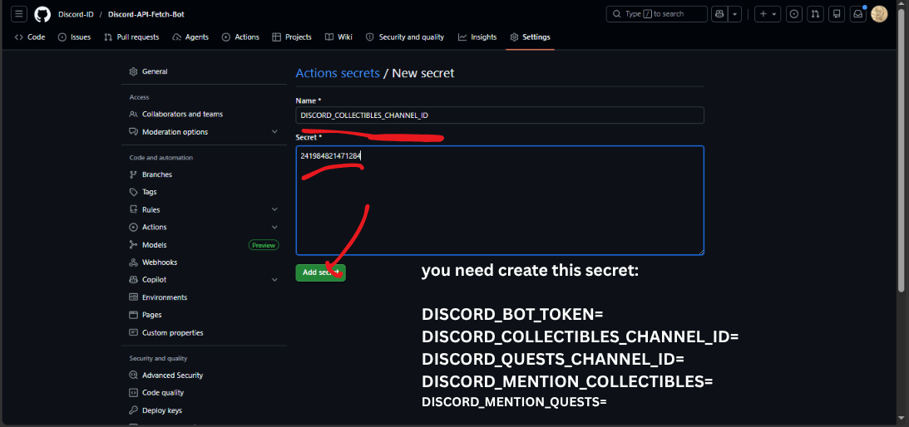
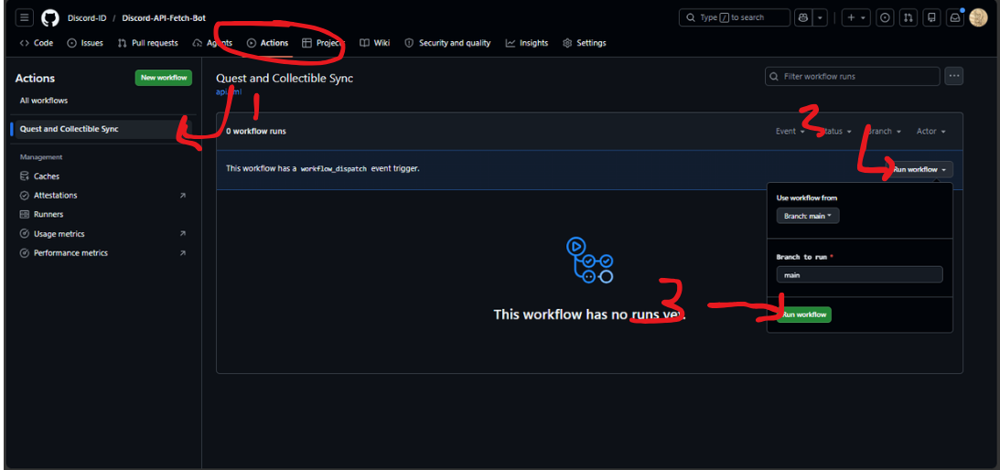

# Discord ID API Fetching Bot

This repository is a Discord bot job that fetches collectibles and quests, builds Discord message payloads, and posts them directly through the Discord REST API.
- Fetches live collectibles and quests data from configured APIs
- Builds announcement messages and thread payloads
- Posts results to Discord channels using a bot token
- Persists state in `state.json` to avoid reposting the same items
- Runs automatically on GitHub Actions using repository secrets

## How to deploy with GitHub Actions
### Required repository secrets

Set these secrets in GitHub: `Settings > Secrets and variables > Actions`.

- `DISCORD_BOT_TOKEN`
- `DISCORD_COLLECTIBLES_CHANNEL_ID`
- `DISCORD_QUESTS_CHANNEL_ID`
- `DISCORD_MENTION_COLLECTIBLES`
- `DISCORD_MENTION_QUESTS`

### Example secret values

- `DISCORD_BOT_TOKEN`: your Discord bot token
- `DISCORD_COLLECTIBLES_CHANNEL_ID`: channel ID for collectible starter posts
- `DISCORD_QUESTS_CHANNEL_ID`: channel ID for quest posts
- `DISCORD_MENTION_COLLECTIBLES`: mention role for collectible posts (role or everyone)
- `DISCORD_MENTION_QUESTS`: mention role for quest posts

 
 
 
 
 
 
 
 